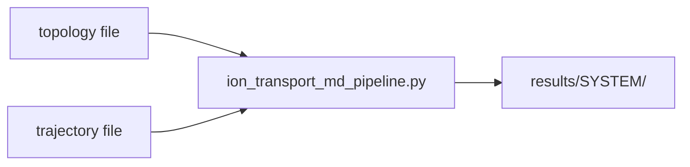
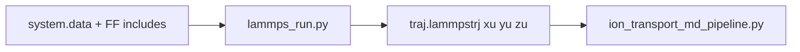
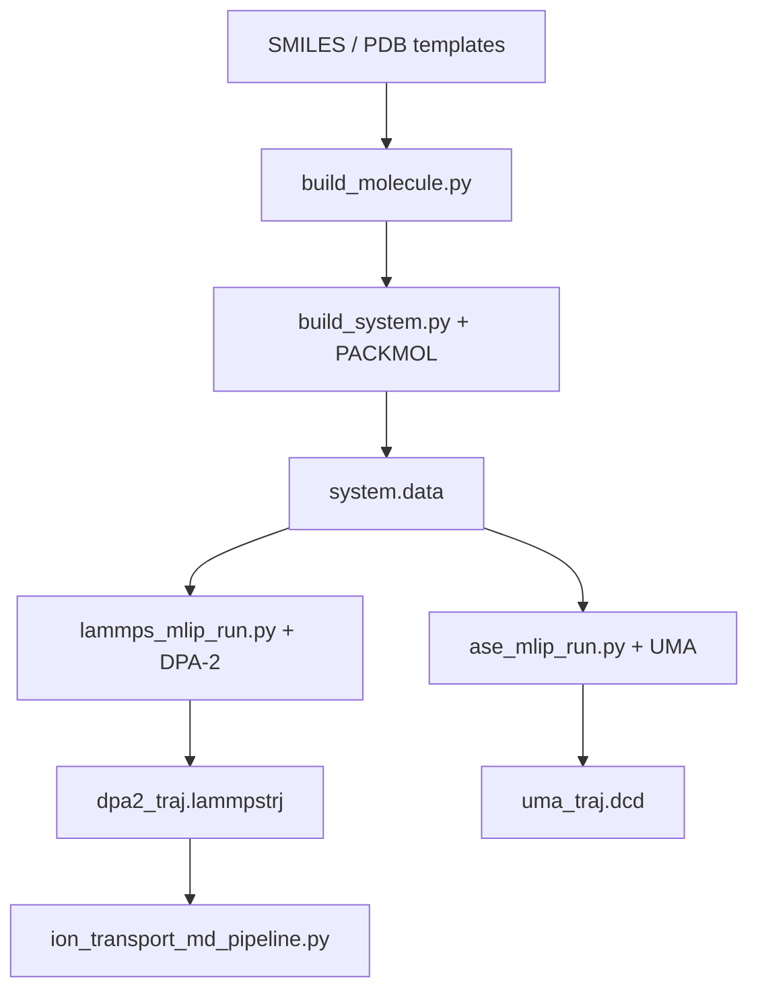
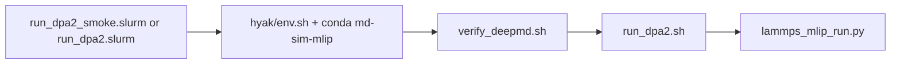

# Ion-Transport MD Pipeline — Full Design & Change Log

> **For agentic workers:** This document records what was built, why, and how. Use `memory.md` for day-to-day notes; use this file for onboarding and architecture review. Future work should extend v0.7+ items listed in §12, not duplicate existing layers.

**Goal:** Python workflow to study Li⁺ transport in quasi-solid polymer electrolytes (DAC, CgPEI, CgBPEI): generate or import MD trajectories, compute `D_Li` and mechanistic descriptors, optionally compare two MLIPs (DeepMD DPA-2 vs Meta UMA).

**Architecture:** Three independent layers share YAML configs and filesystem paths but do not import each other at runtime. Layer B (MDAnalysis analysis) consumes any trajectory. Layer A-classic (LAMMPS + user force field) and Layer A-MLIP (PACKMOL build + DPA-2/UMA MD) are alternative ways to produce trajectories. Batch drivers invoke scripts via subprocess so each CLI remains the single source of truth.

**Tech Stack:** Python 3.10+, MDAnalysis, NumPy, SciPy, pandas, matplotlib, PyYAML; optional LAMMPS Python API, deepmd-kit, fairchem (UMA), ASE, RDKit, PACKMOL; Slurm on UW Hyak for GPU jobs.

---

## 1. Project evolution (what changed when)

| Phase | Version | What was added | Why |
|-------|---------|----------------|-----|
| Initial spec | — | User provided ion-transport planning document (MSD → D_Li, RDFs, clusters, residence grid, ML roadmap) | Research target: compare DAC / CgPEI / CgBPEI electrolytes |
| First implementation | v0.1–v0.4 | Layer B analyzer, classical `lammps_run.py`, batch `run_all_systems.py`, `plot_summary.py`, three YAML configs | Deliver spec §6.1–6.10 + §8 outputs without over-building ML |
| Force-field discussion | — | User asked about COMPASS; clarified LAMMPS has functional forms not parameters; recommended OPLS/moltemplate then pivoted | COMPASS params are MS-proprietary; ion transport needs validated Li-anion chemistry |
| MLIP pivot | v0.6 | `build_molecule.py`, `build_system.py`, `lammps_mlip_run.py`, `ase_mlip_run.py`, `run_all_mlip.py`, extended configs, 24 unit tests | User chose DPA-2 (LAMMPS) + UMA (ASE), no active learning, keep simple |
| Hyak deployment | v0.6+ | `hyak/` shell + Slurm scripts for DPA-2 smoke/full runs on UW GPU nodes | User runs production MD on server, not laptop |
| Repo hygiene | — | `.gitignore` (no venv, models, trajectories); `hyak/env.sh` gitignored | Safe GitHub upload |

**Explicitly not built (per Karpathy “simplicity first”):**

- v0.5 ML dataset builder (`ml_dataset.csv`)
- v1.0 descriptor regression / XGBoost
- v2.0 E(3)-equivariant structure-to-transport model
- `scripts/validate_mlip.py` (energy/force MAE between MLIPs)
- DP-GEN active learning loop (reserved v0.7)
- Materials Studio / `msi2lmp` automation
- Per-subgroup oxygen typing for separate Li-O(DAC) vs Li-O(PDOL) RDFs under MLIP element-only typing

---

## 2. Repository layout (every file’s job)

```text
MD_Sim/
├── README.md                          User-facing quickstarts (all three layers)
├── memory.md                          Short living design log (edit as code evolves)
├── requirements.txt                   Layer B: MDAnalysis, scipy, tidynamics, ...
├── requirements-mlip.txt              Layer A-MLIP: deepmd-kit, fairchem, ase, rdkit, pytest
├── .gitignore                         Ignores venvs, models/*.pb, trajectories, hyak/env.sh
│
├── configs/
│   ├── dac.yaml                       Full pipeline config for DAC system
│   ├── cgpei.yaml                     CgPEI (+ PEI nitrogen selection)
│   └── cgbpei.yaml                    CgBPEI (+ branched PEI)
│
├── scripts/
│   ├── ion_transport_md_pipeline.py   Layer B: analyze CLI (MSD, RDF, clusters, grid)
│   ├── lammps_run.py                  Layer A-classic: LAMMPS + GPU package + FF includes
│   ├── run_all_systems.py             Batch Layer B only (subprocess per config)
│   ├── plot_summary.py                Aggregate results/ → summary.csv + PNG
│   ├── build_molecule.py              SMILES → PDB (RDKit) for PACKMOL templates
│   ├── build_system.py                PACKMOL → LAMMPS atomic data file
│   ├── lammps_mlip_run.py             DPA-2 via pair_style deepmd (LAMMPS Python API)
│   ├── ase_mlip_run.py                UMA via fairchem + ASE Langevin NVT
│   └── run_all_mlip.py                4-stage batch: build → DPA-2 → UMA → analyze
│
├── templates/molecules/
│   ├── Li.pdb                         Hand-written single-atom template
│   ├── DME.pdb                        Example RDKit-generated template
│   └── README.md                      SMILES commands for PF6, TFSI, PDOL, DAC, PEI, BPEI
│
├── tests/                             24 unit tests (light deps only)
│   ├── conftest.py                    Adds scripts/ to sys.path
│   ├── test_build_molecule.py
│   ├── test_build_system.py
│   ├── test_lammps_mlip_run.py          Tests build_commands() only (no LAMMPS binary)
│   ├── test_ase_mlip_run.py
│   └── test_run_all_mlip.py
│
├── hyak/                              UW Hyak Slurm deployment for DPA-2
│   ├── README.md
│   ├── env.example.sh                 Copy → env.sh (account, partition, conda)
│   ├── config_to_env.py               YAML → shell exports for run_dpa2.sh
│   ├── verify_deepmd.sh               Pre-flight: import lammps
│   ├── run_dpa2.sh                    Driver for lammps_mlip_run.py
│   ├── run_dpa2_smoke.slurm           500 equil + 2000 prod steps
│   └── run_dpa2.slurm                 Full steps from YAML
│
├── data/raw_trajectories/{DAC,CgPEI,CgBPEI}/   Gitignored outputs
├── results/{DAC,CgPEI,CgBPEI}/                 Gitignored analyzer outputs
├── models/                                       dpa2.pb, uma weights (gitignored)
│
└── docs/superpowers/plans/
    └── 2026-05-16-ion-transport-md-full-design.md   This file
```

---

## 3. End-to-end data flow

### 3.1 Analysis-only path (Layer B)



**Primary output:** `diffusion_result.json` with `D_cm2_per_s` from MSD slope / 6 (3D Einstein).

### 3.2 Classical MD path (Layer A-classic)



**Design choice:** Force field is never hard-coded. User passes `--pre-include` (pair_style, kspace) and `--post-include` (pair_coeff). GPU via LAMMPS `package gpu` + `suffix gpu` (opt-in `--gpu`).

### 3.3 MLIP path (Layer A-MLIP, v0.6)



**Cross-check strategy:** Run analyzer on DPA-2 trajectory (primary). Re-run analyzer on UMA `.dcd` with same `--top` and type-based selections; compare `D_Li` and `CN_first_shell`. No dedicated energy MAE script.

### 3.4 Hyak GPU path



---

## 4. Layer B — `ion_transport_md_pipeline.py` (design detail)

**Entry:** `python scripts/ion_transport_md_pipeline.py analyze --top ... --traj ... --out ... --li ...`

| Step | Function | Implementation choice | Rationale |
|------|----------|----------------------|-----------|
| Load | `load_universe()` | MDAnalysis `Universe(top, traj)` | One API for LAMMPS/GROMACS/DCD/xtc |
| Unwrap | `--unwrap` | `transformations.NoJump()` | Wrapped coords break MSD |
| MSD | `compute_msd_and_diffusion()` | `EinsteinMSD(..., fft=True)` | O(N log N); needs `tidynamics` in requirements.txt |
| D_Li fit | same | `scipy.stats.linregress` on `[tmin, tmax]` | User picks linear region from plot; default middle 50% of lag times |
| Units | same | `D = slope/6`, `D_cm2_s = D_A2_ps * 1e-4` | Spec §6.5 3D diffusion |
| Displacement | `compute_displacement_distribution()` | Preload `[T, N_Li, 3]`, one `--disp-lag-ps` | Simple memory tradeoff |
| RDF | `compute_rdf()` | `InterRDF` + running CN `cumsum(4πr²ρg dr)` | Matches spec §6.7–6.8 |
| First shell | `coordination_number_at_first_min()` | argmax g(r) for r>1 Å, then argmin after peak | Crude; user can read CSV for manual cutoff |
| Clusters | `compute_cluster_stats()` | `distance_array` + 6×6 neighbor histogram | Spec §6.9 free-Li / CIP / aggregate |
| Residence | `compute_residence_grid()` | `np.histogramdd`, 80³ default | Orthogonal box assumed |

**Outputs:** Filenames match spec §8 exactly (`li_msd.csv`, `rdf_Li-O_cellulose.csv`, etc.).

**Batch:** `run_all_systems.py` builds CLI from YAML and `subprocess.run`s — failures isolated per system.

**Summary:** `plot_summary.py` merges `diffusion_result.json`, coordination CSV, association JSON → `results/summary.csv` + bar plot.

---

## 5. Layer A-classic — `lammps_run.py` (design detail)

| Choice | Decision | Alternative rejected |
|--------|----------|---------------------|
| API | `from lammps import lammps` + `lmp.command()` | subprocess to `lmp` binary — harder to capture errors in Python |
| GPU | LAMMPS GPU package (`package gpu N`, `suffix gpu`) | KOKKOS — heavier build, more flags |
| Units | `units real`, dt in fs via `--dt-fs` | metal units — used in MLIP runner instead |
| Trajectory | `dump ... xu yu zu` | wrapped `x y z` — breaks MSD |
| Schedule | minimize → NVT equil → optional NPT → NVT prod | Single-stage — less stable for packed cells |
| Force field | User `--pre-include` / `--post-include` | Baking COMPASS/OPLS — out of scope |

**Assumption:** User runs `--gpu` on Linux + CUDA (e.g. Hyak). macOS has no NVIDIA GPU.

---

## 6. Layer A-MLIP — v0.6 (design detail)

### 6.1 Why MLIP instead of classical FF

User had no starting structures and wanted to avoid Materials Studio / parameter hunting. Foundation MLIPs (DPA-2, UMA) provide energies/forces without `pair_coeff` tables. Tradeoff: slower per step, need GPU server, element-only typing limits RDF subgroup resolution.

### 6.2 Model pairing

| Role | Model | Engine | Trajectory format |
|------|-------|--------|-------------------|
| Primary | DeepMD DPA-2 (`.pb`) | LAMMPS `pair_style deepmd` | `*.lammpstrj` |
| Cross-check | Meta UMA-S | ASE `OCPCalculator("uma-small")` | `*.dcd` |

**No active learning:** DP-GEN deferred to v0.7 unless DPA-2 vs UMA or experiment disagree.

### 6.2 `build_molecule.py`

- **Input:** SMILES, `--out` PDB, `--name` (3-letter residue for PACKMOL).
- **Method:** RDKit embed + MMFF; stamp residue name in columns 18–20.
- **Tests:** DME from `COCCOC`; invalid SMILES → `SystemExit`.

### 6.3 `build_system.py`

- **Input:** YAML `build` section (`composition`, `box_A`, `type_mapping`, `output.data`).
- **PACKMOL:** `packmol_input_text()` formats input; `run_packmol()` subprocess.
- **LAMMPS data:** `pdb_to_lammps_data()` via ASE read PDB → `atom_style atomic`, one type per element, masses from internal dict.
- **No classical pre-equil:** MLIP `minimize` in `lammps_mlip_run.py` handles overlaps.
- **Tests:** PACKMOL text structure; data file atom types 1..N; unknown element exits.

### 6.4 `lammps_mlip_run.py`

- **Pure function:** `build_commands(args) -> list[str]` — unit tested without LAMMPS installed.
- **Units:** `metal` (Å, ps, eV) — DeepMD convention; `dt_ps=0.0005` (0.5 fs).
- **Schedule:** minimize → NVT equil → NVT prod; dump unwrapped; `write_data` final state.
- **pair_style:** `deepmd {model.pb}` + `pair_coeff * *`.

### 6.5 `ase_mlip_run.py`

- **Data read:** Custom `read_lammps_atomic_data()` — ASE LAMMPS reader does not preserve type→element map.
- **Symbols:** `assign_symbols(types, type_map)` from `--type-map "H C N O F P S Li"`.
- **MD:** Langevin NVT; snapshot list → DCD via `ase.io.write`.
- **Tests:** Parser, symbol map, `make_atoms()` cell/box; no fairchem in CI.

### 6.6 `run_all_mlip.py`

- **Stages per config:** build → DPA-2 → UMA → analyze (DPA-2 traj).
- **Pure function:** `build_steps(cfg, py)` — tested for CLI wiring.
- **Failure:** Stops system on first failed stage unless `--continue-on-error`.

### 6.7 Config schema (extended YAML)

Each `configs/*.yaml` now contains:

```yaml
system: DAC
build:
  composition: [{name: Li, count: 30}, ...]
  box_A: [40, 40, 40]
  type_mapping: [{type: 1, element: H}, ...]
  output:
    data: data/raw_trajectories/DAC/system.data
mlip_dpa2:
  model: models/dpa2.pb
  output: {traj: ..., data: ...}
mlip_uma:
  size: small
  output: {traj: ...}
md:
  temp: 300.0
  dt_ps: 0.0005      # LAMMPS metal
  dt_fs: 0.5         # ASE
  equil_steps: 20000
  prod_steps_dpa2: 200000
  prod_steps_uma: 20000
  dump_every: 200
# Layer B (unchanged keys):
top, traj, out, selections, fit, cluster_cut_A, ...
```

**MLIP analysis selections:** `type 8` for Li, `type 6` for P (PF6), `type 4` for all O — cannot split DAC vs PDOL oxygens without retyping.

---

## 7. Hyak deployment (design detail)

| File | Responsibility |
|------|----------------|
| `env.example.sh` | Template: `HYAK_ACCOUNT`, `HYAK_PARTITION`, `HYAK_GPU_TYPE`, `MD_SIM_ROOT`, `CONDA_ENV` |
| `env.sh` | User copy (gitignored) |
| `config_to_env.py` | `eval "$(python3 hyak/config_to_env.py configs/dac.yaml [smoke])"` |
| `verify_deepmd.sh` | `import lammps` before burning GPU hours |
| `run_dpa2.sh` | Checks `system.data` + `dpa2.pb` exist; calls `lammps_mlip_run.py` |
| `run_dpa2_smoke.slurm` | 1 GPU, 1 h wall; smoke step counts |
| `run_dpa2.slurm` | 24 h wall; full `prod_steps_dpa2` from YAML |

**Smoke overrides** (in `config_to_env.py` when second arg is `smoke`):

- `EQUIL_STEPS=500`, `PROD_STEPS=2000` (vs 20000 / 200000 in dac.yaml).

**User must edit before sbatch:** `#SBATCH --account`, `--partition`, `--gpus=` to match `hyakalloc`.

---

## 8. Testing strategy (TDD)

**Principle:** Production code for testable pure functions; integration (LAMMPS, DeepMD, UMA, PACKMOL) runs on Hyak only.

| Module | What tests cover | What tests skip |
|--------|------------------|-----------------|
| `build_molecule` | PDB written, residue name, bad SMILES | — |
| `build_system` | PACKMOL text, LAMMPS data content | Running packmol binary |
| `lammps_mlip_run` | `build_commands()` ordering, deepmd pair_style, dump line | `import lammps` |
| `ase_mlip_run` | data parser, symbol assignment, Atoms | `fairchem`, MD loop |
| `run_all_mlip` | 4-stage CLI lists | subprocess execution |

**TDD incident:** First `build_molecule.py` was written before tests (violates TDD skill). Files deleted and rewritten test-first. Tasks 3–6 followed red-green-refactor.

**Run tests locally:**

```bash
python -m venv .venv-test
.venv-test/bin/pip install pytest rdkit ase numpy pyyaml
.venv-test/bin/pytest tests/ -v
# Expected: 24 passed
```

**Layer B verification (historical):** Synthetic 200-frame random-walk trajectory produced all 18 spec §8 files; MSD fit r≈0.998. Smoke artifacts removed after pass.

---

## 9. Dependencies split

| File | Packages | Used by |
|------|----------|---------|
| `requirements.txt` | MDAnalysis, numpy, scipy, pandas, matplotlib, PyYAML, **tidynamics** | Layer B only |
| `requirements-mlip.txt` | deepmd-kit, fairchem-core, torch, ase, rdkit, pytest | Layer A-MLIP + tests |

**Conda (Hyak / GPU server):**

```bash
conda install -c deepmodeling deepmd-kit lammps
conda install -c conda-forge packmol
```

LAMMPS from `deepmodeling` channel includes `pair_style deepmd`; plain conda-forge LAMMPS may not.

---

## 10. Git / GitHub choices

**.gitignore ignores:**

- Virtualenvs (`.venv/`, `.venv-test/`)
- `models/*.pb`, `models/uma/`
- All trajectory and analyzer outputs under `data/raw_trajectories/` and `results/`
- `hyak/env.sh` (account names)

**Committed:** code, configs, templates (`Li.pdb`, `DME.pdb`), `hyak/env.example.sh`, docs.

**Upload workflow:**

```bash
git init
git add .
git commit -m "Initial commit: ion-transport MD pipeline"
git remote add origin https://github.com/USER/MD_Sim.git
git push -u origin main
```

---

## 11. Key equations (spec alignment)

**MSD (Einstein):** `MSD(t) = ⟨|r(t₀+t) − r(t₀)|²⟩` averaged over ions and origins.

**Diffusion (3D):** `D = slope(MSD vs t) / 6`

**Unit conversion:** `D_cm²/s = D_Ų/ps × 10⁻⁴`

**Running CN:** `CN(r) = ∫ 4πr² ρ_B g(r) dr` with `ρ_B = N_B / V_box`

**Ion association (histogram):** free Li = 0 anion neighbors within cutoff; CIP = 1; aggregate = ≥2.

---

## 12. Roadmap — what to build next

| Version | Item | Trigger |
|---------|------|---------|
| v0.7 | DP-GEN active learning | DPA-2 vs UMA or experiment disagree |
| v0.5 | `ml_dataset.csv` builder | When ≥3 systems have validated `D_Li` |
| v1.0 | Descriptor ML (RF/XGBoost on CN, free-Li, etc.) | After v0.5 |
| v2.0 | E(3) equivariant model | Research milestone |
| — | Per-subgroup O typing for MLIP RDFs | If Li-O(scaffold) vs Li-O(polymer) CN required |
| — | `validate_mlip.py` energy/force MAE | If trajectory-level compare insufficient |
| — | Hyak Slurm for `build_system.py` + full `run_all_mlip.py` | After DPA-2 smoke passes |

---

## 13. Operator checklist (Hyak DPA-2 smoke)

- [ ] Clone repo; `cp hyak/env.example.sh hyak/env.sh` and edit account/paths
- [ ] `conda create -n md-sim-mlip` + `conda install -c deepmodeling deepmd-kit lammps`
- [ ] `pip install -r requirements.txt pyyaml`
- [ ] `models/dpa2.pb` present
- [ ] Molecular PDBs in `templates/molecules/` (see README there)
- [ ] `python scripts/build_system.py --config configs/dac.yaml`
- [ ] `bash hyak/verify_deepmd.sh`
- [ ] Edit `#SBATCH --account` in `hyak/run_dpa2_smoke.slurm`
- [ ] `mkdir logs && sbatch hyak/run_dpa2_smoke.slurm`
- [ ] On success: `sbatch hyak/run_dpa2.slurm` or `run_all_mlip.py` for full pipeline

---

## 14. Related documents

| Document | Purpose |
|----------|---------|
| [memory.md](../../memory.md) | Short living design notes |
| [README.md](../../README.md) | Command cheat sheet |
| [hyak/README.md](../../hyak/README.md) | Hyak-specific setup |
| User’s original planning doc | Full spec §9–11 (ML labels, validation, risks) — mostly future work |

---

*Document generated 2026-05-16. Covers repository state through v0.6 + Hyak scripts.*
